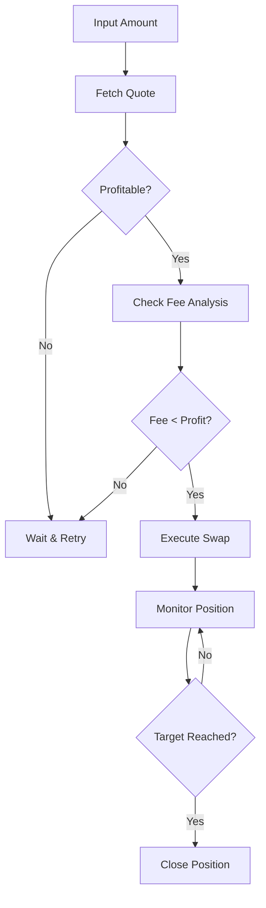

<div align="center">


[](https://git.io/typing-svg)

<br>

[](https://python.org)
[](https://flask.palletsprojects.com)
[](https://socket.io)
[](https://arbitrum.io)
[](LICENSE)

<br>


</div>


</div>

---

## ✨ Features

<details open>
<summary><h3>🎯 Core Scalping Features</h3></summary>

| Feature | Description | Status |
|---------|-------------|--------|
| ⚡ **500ms Auto-Refresh** | Real-time quote updates every 0.5 seconds | ✅ Active |
| 📊 **Fee Breakdown** | Protocol, Gas, Slippage analysis in real-time | ✅ Active |
| 💰 **Total Fee %** | Display total deduction as percentage | ✅ Active |
| 🏆 **DEX Comparison** | Compare Bebop vs 1inch vs Paraswap | ✅ Active |
| 📈 **Live Chart** | Real-time price chart with Chart.js | ✅ Active |
| 💹 **Market Ticker** | Live market data feed | ✅ Active |
| 🎯 **Scalping Signals** | Automated trading signals | ✅ Active |

</details>

<details>
<summary><h3>🔧 Technical Features (50+)</h3></summary>

#### 🚀 Performance
1. ⚡ **Sub-second Quote Updates** - 500ms refresh interval
2. 🔄 **WebSocket Real-time Communication** - Socket.IO integration
3. 💾 **Smart Caching** - Price cache with TTL
4. 📊 **Price History Tracking** - Volatility & trend analysis
5. 🧵 **Multi-threading** - Background workers for updates
6. 🌐 **Cloudflared Tunnel** - Public URL generation
7. 📱 **Responsive Design** - Mobile & desktop optimized

#### 🔒 Security
8. 🔐 **MEV Protection** - Protection from MEV attacks
9. 🛡️ **No Private Key Storage** - MetaMask integration only
10. 🔏 **Transaction Signing** - User-controlled signing
11. 🚫 **No Data Collection** - Privacy-first approach
12. ✅ **Input Validation** - Secure parameter handling

#### 💎 UI/UX
13. 🌈 **Futuristic Neon Theme** - Cyberpunk aesthetic
14. ✨ **Animated Background** - Particle effects & grid overlay
15. 🎨 **Glassmorphism Design** - Modern translucent UI
16. 🌊 **Smooth Animations** - CSS transitions & keyframes
17. 🔔 **Toast Notifications** - Interactive feedback
18. 🎭 **Modal Dialogs** - Token selector & settings
19. 📐 **Clip-path Buttons** - Unique geometric shapes

#### 💰 Financial Analysis
20. 💵 **Protocol Fee Calculation** - Bebop RFQ fees
21. ⛽ **Real-time Gas Estimation** - Arbitrum network fees
22. 📉 **Slippage Cost Analysis** - Price impact calculation
23. 📊 **Price Impact (bps)** - Basis points display
24. 💸 **Total Fee Display** - Complete cost breakdown
25. 📈 **Fee Percentage** - % of total transaction
26. ✨ **Net Output Value** - What you actually receive

#### 🪙 Token Support
27. 🏦 **15 Popular Tokens** - ETH, WETH, USDC, USDT, DAI
28. 🟣 **WBTC Support** - Wrapped Bitcoin
29. 🔵 **ARB Token** - Arbitrum native
30. 🔗 **LINK Token** - ChainLink
31. 🦄 **UNI Token** - Uniswap
32. 📈 **GMX Token** - GMX Protocol
33. 💎 **RDNT Token** - Radiant Capital
34. 🌟 **STG Token** - Stargate Finance
35. 🎩 **MAGIC Token** - Treasure DAO
36. 🎯 **PENDLE Token** - Pendle Finance
37. 🏆 **GRAIL Token** - Camelot DEX

#### 🔌 Wallet Integration
38. 🦊 **MetaMask Support** - Full MetaMask integration
39. 💼 **Balance Detection** - Automatic token balance fetch
40. 👤 **Address Display** - Formatted wallet address
41. 🌐 **Network Detection** - Chain ID verification
42. 🔄 **Account Change Listener** - Auto-update on switch

#### ⚙️ Customization
43. 📊 **Slippage Settings** - 0.1%, 0.5%, 1%, Custom
44. ⏱️ **Transaction Deadline** - 5-30 minutes
45. 🛡️ **MEV Toggle** - Enable/disable protection
46. 🎨 **Theme Consistency** - Neon color scheme

#### 📡 API Integration
47. 🔗 **Bebop.xyz RFQ API** - Primary DEX aggregator
48. 💰 **CoinGecko API** - Price data
49. ⛽ **Arbitrum RPC** - Gas price estimation
50. 🔄 **Auto-retry Logic** - Failed request handling

</details>

---

## 🚀 Quick Start

### Prerequisites

```bash
# Update packages
pkg update && pkg upgrade -y

# Install Python & dependencies
pkg install python -y
pip install flask flask-socketio requests

# Install cloudflared
pkg install cloudflared -y
```

### Installation

```bash
# Clone repository
git clone https://github.com/bobacheese/bebop-scalper-pro.git
cd bebop-scalper-pro

# Run application
python bebop_scalper_pro.py
```

### Access

Wait for the public URL to appear:

```
============================================================
✅ BEBOP SCALPER PRO v3.0 ONLINE!
============================================================
🌐 URL Publik: https://xxxxx-xxx-xxx.trycloudflare.com
============================================================
```

---

## 📊 Fee Analysis Example

<div align="center">

### Input: 1000 USDC → WETH

| Component | Amount | Details |
|-----------|--------|---------|
| 💵 **Biaya Protokol** | $0.50 | Bebop RFQ (0.05%) |
| ⛽ **Biaya Gas** | $0.05 | Arbitrum Network |
| 📉 **Biaya Slippage** | $0.01 | Price difference |
| 📊 **Price Impact** | 0.50 bps | Market depth |
| 💸 **Total Potongan** | **$0.56** | **(0.056%)** |
| ✨ **Nilai Bersih** | **$999.44** | What you receive |

</div>

---

## 🎨 UI Showcase

<div align="center">

### 🌈 Futuristic Neon Theme

```
┌─────────────────────────────────────────────────────────┐
│  ⚡ BEBOP SCALPER PRO  │  Gas: 0.10 Gwei  │  🟢 Live  │
├─────────────────────────────────────────────────────────┤
│                                                         │
│  ┌──────────────┐          ┌──────────────┐            │
│  │ JUAL         │    ⇅     │ BELI         │            │
│  │ ETH  0.00    │─────────▶│ USDC 0.00    │            │
│  │ ≈ $0.00      │          │ ≈ $0.00      │            │
│  └──────────────┘          └──────────────┘            │
│                                                         │
│  📊 ANALISIS BIAYA REAL-TIME                            │
│  ┌─────────┬─────────┬─────────┬─────────┐             │
│  │Protocol │  Gas    │Slippage │ Impact  │             │
│  │ $0.50   │ $0.05   │ $0.01   │0.50 bps │             │
│  └─────────┴─────────┴─────────┴─────────┘             │
│                                                         │
│  💸 Total Potongan: $0.56 (0.056%)                      │
│  ✨ Nilai Bersih: $999.44                               │
│                                                         │
│  ┌─────────────────────────────────────┐               │
│  │     ⚡ TUKAR SEKARANG               │               │
│  └─────────────────────────────────────┘               │
│                                                         │
└─────────────────────────────────────────────────────────┘
```

</div>

---

## 🛠️ Tech Stack

<div align="center">

| Category | Technology |
|----------|------------|
| **Backend** |   |
| **Real-time** |  |
| **Frontend** |    |
| **Charts** |  |
| **Blockchain** |  |
| **Tunnel** |  |

</div>

---

## 📈 Performance Metrics

<div align="center">

| Metric | Value |
|--------|-------|
| ⚡ **Quote Refresh** | 500ms |
| 💰 **Price Update** | 5 seconds |
| ⛽ **Gas Update** | 5 seconds |
| 📊 **Chart Points** | 50 data points |
| 🎯 **API Timeout** | 5 seconds |
| 🔄 **Cache TTL** | 3 seconds |

</div>

---

## 🔗 API Endpoints

```
GET /api/quote        - Get RFQ quote from Bebop
GET /api/tokens       - List supported tokens
GET /api/prices       - Get current prices
GET /api/health       - Health check
```

---

## 🎯 Scalping Strategy

<div align="center">



</div>

---

## 👨‍💻 Author

<div align="center">


### 🚀 Full-Stack Developer | Blockchain Enthusiast | Crypto Trader

<br>

[](https://github.com/bobacheese)
[](https://youtube.com/@bobacheese?si=5M2leEilS3_VmNS6)
[](https://coff.ee/amarullohzd)

<br>

> *"Code is poetry, trading is art, and I'm just trying to master both."*

<br>


<br>


</div>

---

## ☕ Support

<div align="center">

If you find this project helpful, consider buying me a coffee!

[](https://coff.ee/amarullohzd)

<br>

**Bitcoin:** `bc1q...`  
**Ethereum:** `0x...`  
**USDC (Arbitrum):** `0x...`

</div>

---

## 📜 License

<div align="center">

[](LICENSE)

**Copyright © 2024 AMARULLOH ZIKRI**

Permission is hereby granted, free of charge, to any person obtaining a copy
of this software and associated documentation files (the "Software"), to deal
in the Software without restriction, including without limitation the rights
to use, copy, modify, merge, publish, distribute, sublicense, and/or sell
copies of the Software, and to permit persons to whom the Software is
furnished to do so, subject to the following conditions:

</div>

---

<div align="center">


<br>

[](https://github.com/bobacheese)

**⭐ Star this repo if you find it useful!**

</div>
